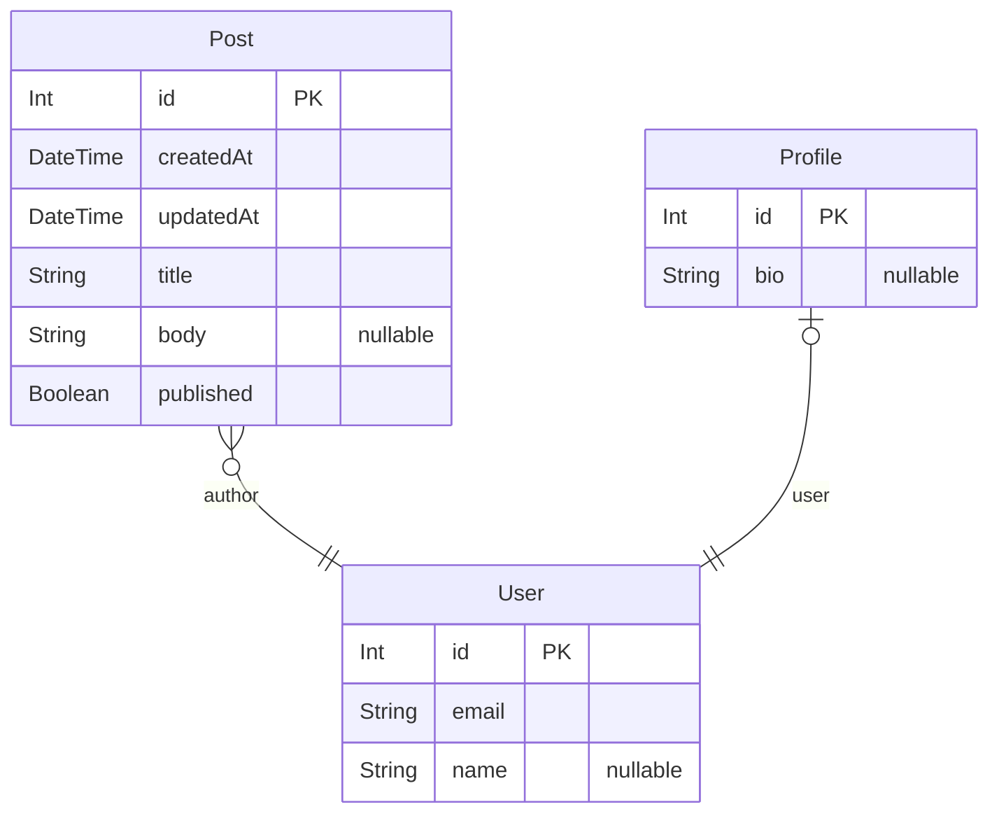

```mermaid
erDiagram

  Post {
    Int id PK 
    DateTime createdAt  
    DateTime updatedAt  
    String title  
    String body  "nullable"
    Boolean published  
    }
  

  Profile {
    Int id PK 
    String bio  "nullable"
    }
  

  User {
    Int id PK 
    String email  
    String name  "nullable"
    }
  
    Post o{--|| User : "author"
    Profile o|--|| User : "user"
```
